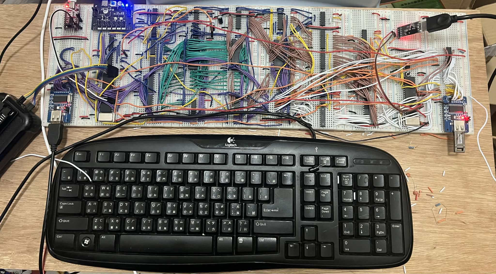

# picos (temporary name)
An operating system running on PIC18F4520 chip. It is not only an OS but a hardware-software co-design project featuring external memory access acceleration.



## Features
- ⚙️ **Preemptive Scheduler** - A timer-interrupt–based scheduler
- 🧩 **2MB External SRAM** - One-byte-per-instruction efficiency through custom circuit design
- 🔌 **USB Host (CH375B)** - Full USB enumeration with support for HID keyboards
- ⌨️ **USB Keyboard Input** - Real HID keyboard support with parsed USB reports
- 💾 **USB Mass Storage Support** - USB Flash Drive block access
- 🚀 **DMA-based Disk I/O** - Direct transfer between USB storage and a dedicated SRAM bank, isolating disk buffers from execution memory

TBD...


## Build
First, make sure you have the xc8 compiler.
Second, download and unzip the following file in the repository directory:
```shell
wget https://packs.download.microchip.com/Microchip.PIC18Fxxxx_DFP.1.7.171.atpack
unzip Microchip.PIC18Fxxxx_DFP.1.7.171.atpack -d dfp
```
- If you are using a 40 MHz external clock source, simply run:
```
make
```
- If you are using the internal 4 MHz clock source, add the option INTERNAL_CLOCK=1:
```
make INTERNAL_CLOCK=1
```

## How To Run
First, you should have a PIC18F4520 chip and a USB-to-serial module. 

TBD...
